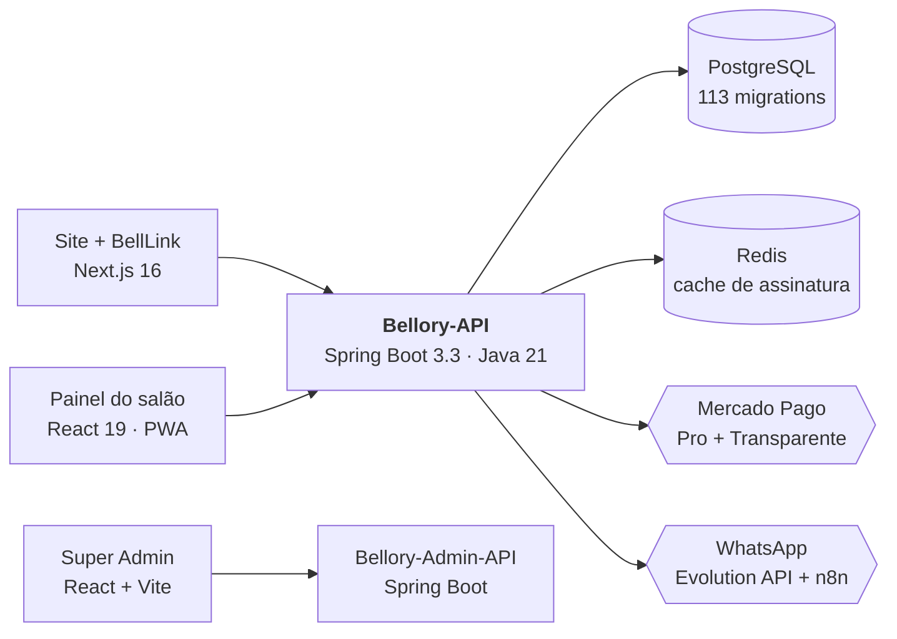

<div align="center">


<br/>

**Construo produtos inteiros — do banco de dados ao pixel.**

<br/>

[](https://guikbit.vercel.app)
[](https://www.linkedin.com/in/guilherme-oliveira-771318203/)
[](mailto:guilhermeoliveira1998@gmail.com)
[](https://github.com/GuikBit)

</div>

---

## Sobre mim

Desenvolvedor **Full Stack** com experiência sólida nas duas pontas: as interfaces que as pessoas usam todo dia e as arquiteturas que as sustentam. Meu trabalho recente é um **SaaS multi-tenant em produção** — não um exercício: tem clientes reais, dinheiro passando por dentro e uptime que importa.

- **Atuação:** Full Stack Developer na [Pluri Sistemas](https://github.com/GuikBit)
- **Localização:** Juiz de Fora, MG — Brasil
- **Foco atual:** React 19, Next.js, Spring Boot, .NET e arquiteturas multi-tenant
- **Especialidades:** APIs RESTful, integrações de pagamento, automação com IA, design systems

> *"Clean code, great design, powerful solutions."*

---

## Projeto em destaque — Bellory

**SaaS multi-tenant de gestão para barbearias, salões de beleza e clínicas de estética.** Um único produto que cobre o caminho inteiro, da captação do cliente ao fechamento do caixa: site de vendas, agendamento online, painel administrativo completo, e-commerce, financeiro, pagamento online e um agente de IA que atende pelo WhatsApp.

<div align="center">

[](https://bellory.com.br)
[](https://app.bellory.com.br)

</div>

### Arquitetura



### Os módulos

<table>
<tr>
<td width="50%" valign="top">

#### [Bellory-API](https://github.com/GuikBit/Bellory-API) — o núcleo
**Java 21 · Spring Boot 3.3 · PostgreSQL · Redis**

O cérebro do produto, e onde vive toda regra de negócio. Multi-tenancy por contexto de requisição, RBAC com 7 papéis e 60+ permissões granulares, e um domínio financeiro de verdade — contas a pagar e receber, DRE, fluxo de caixa, comissionamento e conciliação de cobranças.

Integra **Mercado Pago nos dois modos** (Checkout Pro e Transparente/Orders API), com o webhook como fonte da verdade do pagamento; dispara **WhatsApp** por Evolution API + fluxos n8n; emite relatórios em CSV, PDF e XLSX; e envia **Web Push** (VAPID).

`Spring Security + JWT` · `Flyway` · `JPA/Hibernate` · `OpenAPI` · `Caffeine + Redis` · `OpenPDF` · `Apache POI`

</td>
<td width="50%" valign="top">

#### [Bellory-front](https://github.com/GuikBit/barbearia) — o painel do salão
**React 19 · TypeScript · Vite 8 · PWA**

O sistema que o dono do salão abre todo dia: agenda multiprofissional, clientes, colaboradores, serviços, pacotes de crédito pré-pago, estoque com Kardex auditável, PDV, financeiro e relatórios.

É um **PWA de verdade** — o Service Worker enfileira mutações com Background Sync, então a agenda continua funcionando sem internet e sincroniza sozinha quando ela volta. Cada tenant escolhe entre **6 temas**, com cores e tipografia vindas da API e aplicadas em tempo de execução.

`TanStack Query` · `PrimeReact` · `Tailwind v4` · `Framer Motion` · `Chart.js` · `Three.js` · `vite-plugin-pwa`

</td>
</tr>
<tr>
<td width="50%" valign="top">

#### [Bellory](https://github.com/GuikBit/Bellory) — site
**Next.js 16 · App Router · TypeScript**

A vitrine e a porta de entrada. Site de marketing com páginas por segmento, SEO estruturado em JSON-LD e CSS crítico inlined no build para Core Web Vitals.

Hospeda também o **BellLink**, o "link na bio" de cada salão: página pública com vitrine de produtos, horários e um **fluxo de agendamento completo embutido** — identificação por telefone, escolha de serviço e profissional, cupom de desconto e pagamento com Payment Brick, sem sair da página.

`Server Components` · `ISR` · `React Query` · `Framer Motion` · `Zod` · `Leaflet`

</td>
<td width="50%" valign="top">

#### [Bellory-admin](https://github.com/GuikBit/Bellory-admin) + [Admin-API](https://github.com/GuikBit/Bellory-Admin-API)
**React · Spring Boot · Docker**

O painel de quem opera a plataforma, não o salão: gestão de tenants, planos e assinaturas, blocklist de slugs reservados e visão consolidada da base.

<br/>

#### [Bellory-docs](https://github.com/GuikBit/Bellory-docs)
**Markdown · n8n**

Cerca de 90 especificações técnicas versionadas e os fluxos reais do **agente de IA** que consulta horários, agenda, reagenda e cadastra clientes pelo WhatsApp.

</td>
</tr>
</table>

### Engenharia em números

<div align="center">

| Módulo | Escala | Stack |
|:---|:---|:---|
| **Bellory-API** | 485 endpoints · 875 classes · 142 entidades · 113 migrations | Java 21 · Spring Boot 3.3 |
| **Painel do salão** | 456 arquivos · ~182k linhas · 206 componentes | React 19 · Vite 8 · TS |
| **Site + BellLink** | 199 arquivos · SSG + ISR | Next.js 16 · React 19 |
| **Ecossistema** | **5 repositórios** · **+1.300 commits** | Full Stack |

</div>

---

<!-- ## Outros projetos

<table>
<tr>
<td width="50%" valign="top">

### OdontoSync — gestão odontológica
Sistema integrado para clínicas odontológicas: prontuário, agenda e faturamento, com aplicativo mobile para o paciente.

| Componente | Stack |
|:---|:---|
| **[Angular-Odonto](https://github.com/GuikBit/Angular-Odonto)** | Angular + PrimeNG |
| **[API-Odonto](https://github.com/GuikBit/API-Odonto)** | C# / .NET + MySQL |
| **[Mobile-Odonto](https://github.com/GuikBit/Mobile-Odonto)** | React Native + Expo |

</td>
<td width="50%" valign="top">

### [AgenteIA](https://github.com/GuikBit/AgenteIA) — agente inteligente
Experimentos com agentes de IA em TypeScript: RAG, tool calling e orquestração de conversas.

<br/>

### Todos os repositórios
Mais de 20 projetos entre APIs, front-ends e experimentos.

[](https://github.com/GuikBit?tab=repositories)

</td>
</tr>
</table>

--- -->

## Stack tecnológico

<div align="center">

#### Linguagens


#### Frontend


#### Backend


#### Dados e infraestrutura


#### Integrações e ferramentas


</div>

---

## Métricas de contribuição

<div align="center">


</div>

---

## Conquistas

<div align="center">

[](https://github.com/ryo-ma/github-profile-trophy)

<br/>


</div>

---

<div align="center">

```typescript
const developer = {
  name: "Guilherme Oliveira",
  role: "Full Stack Developer",
  stack: {
    frontend: ["React", "Next.js", "Angular", "React Native"],
    backend: ["Spring Boot", ".NET", "Node.js"],
    data: ["PostgreSQL", "MySQL", "MongoDB", "Redis"],
  },
  shipping: "Bellory — SaaS multi-tenant em produção",
  motto: "Clean code, great design, powerful solutions",
};
```

<br/>

**Aberto a novos desafios e oportunidades de colaboração.**

[](https://guikbit.vercel.app)

<br/>


</div>
